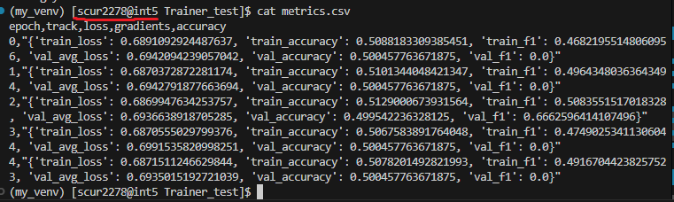
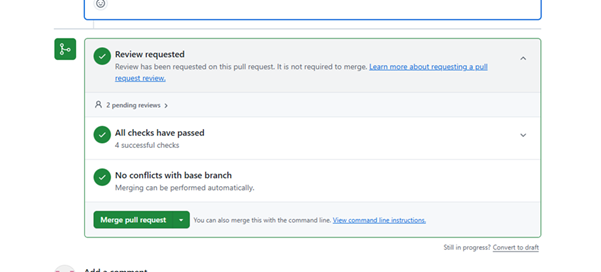
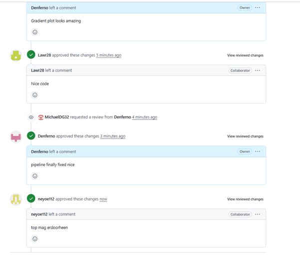

# Assignment 2: MLOps & PCAM Pipeline Journal
**MLOps & ML Programming (2026)**

## Group Information
* **Group Number:** [25]
* **Team Members:** [Member 1 Lawrence 15277844, Member 2 Michael Dong 15804232, Member 3 Dennis Chan 15833526, Member 4 Ngawang Tsarong 15833526]
* **GitHub Repository:** [https://github.com/Denferno/MLOps_2026]
* **Base Setup Chosen from Assignment 1:** [Dennis Chan]

---

## Question 1: Reproducibility Audit
1. **Sources of Non-Determinism:**

   1. Pytorch CUDA determinism (GPU)
Wanneer je GPU (CUDA) gebruikt, dan gebruikt PyTorch niet deterministische algoritmes voor de snelheid. Zelfs als we alle seeds erbij zetten kunnen sommige berekeningen toch net anders zijn waardoor het net een andere resultaat produceert. 

   2. DataLoader "Shuffle" Probleem.
   Dataloader die shuffelt (door shuffle=True) de data waardoor alle waardes een willekeurige waarde krijgen en dat zorgt ervoor dat het niet meer deterministisch is.

   3. Verschillende CPUs en GPu maken de exact dezelfde berekingen maar net iets anders, omdat computers geen perfecte decimalen kunnen opslaan en ronden tussendoor ook af en daardoor kunnen later er verschillen ontstaan in de training en hierdoor is perfect identiek niet haalbaar.  

   4. Omdat num_workers=2 meerdere processen gebruikt, heeft elke worker zijn eigen random state. Zonder worker-seeding kan de batchvolgorde/preprocessing per run nét verschillen, ook met dezelfde seed. Dat kan kleine verschillen in training en eindresultaat geven.


2. **Control Measures:**
   1. CUDA determinism is nu niet controlled. We kunnen het controllen door in seed_everything()
   ```python 
   torch.backends.cudnn.deterministic = True #dit zorgt voor altijd dezelde convolution algoritme
   torch.backends.cudnn.benchmark = False #dit zet auto tuning uit
   ```
   Dit schakelt CUDA performance optimalisaties uit waardoor trainen dus langzamer wordt, maar het garandeert wel identieke runs met exact dezelfde resultaten. Voor kleine datasets is dit aan te raden om aan te zetten. Dit passen we niet toe, want 18 gb is best veel. 

   2. Parallle reduction order is nu niet controlled. We kunnen het compleet controllen door:
   ```python
   losses_batch = []
   for image, label in dataloader:
      #  training code 
      losses_batch.append(loss.item() * batch_size)  # elke individuele waarde 

   # Sum sequentially at the end
   avg_loss = sum(losses_batch) / total_samples
   ```
   Wat hier wordt gedaan is dus dat elke loss wordt opgeslagen in een aparte lijst. Deze wordt aan het einde opgetelt ipv dat het steeds na elke loop erbij wordt opgetelt. Hierdoor is de optelvolgorde vast en reproduceerbaar. Wij hebben dit niet toegevoegd, want hierdoor wordt het trainen veel trager.

   3. Floating point is nu niet controlled en we kunnen het ook niet compleet elimineren. Verschillende hardware, andere libraries en parallel reduction order zorgen ervoor dat floating point probleem lastig op te lossen is. We zouden meer decimalen achter kunnen toevoegen, bijvoorbeeld
   ```python
   torch.set_default_dtype(torch.float64)
   ```
   Hierdoor gebruiken we float64 ipv float32, maar de training zal veel langzamer worden. 

   Daarnaast helpt het ook om een bestand kunnen maken waar we precies documenteren wat de versie is van de python, pytorch, cuda. cuDNN etc. Het lost het decimale probleem niet op, maar zorgt wel voor reproduceerbaarheid op dezelfde hardware configuratie. Dit hebben wij ook gedaan in onze `reproducibility.txt` file. 

   4. Dit is ook niet controlled. We hadden eerst num_workers = 2 in `train_config.yaml'. Voor deterministisch resultaat moeten we num_workers = 0 zetten, hierdoor zal het trainen veel trager zijn. Daarom zullen we dit ook niet toepassen. 

3. **Code Snippets for Reproducibility:**
   ```python
   # Paste the exact code added for seeding and determinism
   ```
   zie boven

4. **Twin Run Results:**




---

## Question 2: Data, Partitioning, and Leakage Audit
1. **Partitioning Strategy:**
We hebben gebruikgemaakt van al gedefinieerde Train, Validation en
Test splits van de dataset. De data was op bestandsniveau gesplitst
in afzonderlijke HDF5-bestanden per split.
We hebben de predefined h5 splits gebruikt en geen shuffle of resplit

Final counts for each split
Train: 80
Validation: 10
Test: 10

2. **Leakage Prevention:**
Voor geen data leakage hebben we gebruik gemaakt van onze voorgedefinieerde PCAM split waardoor we geen patient overlap hebben. Een patient kan dus niet in zowel de training als testset voorkomen. We hebben geen gebruik gemaakt van normalisatie. We gebruikten alleen transform.ToTensor() die dus per afbeelding de pixelwaarden van 0-255 naar 0.0-1.0 schaalt (delen door 255), zonder dat we dus gebruik maken van statistieken. Zo blijft ook onze testdata onbekend terein voor het model, waardoor het een eerlijke evaluatie kan geven.   
3. **Cross-Validation Reflection:**
K fold cross validation is handig maar hier niet per se nodig, omdat de dataset al best groot is en er al vaste splits geleverd zijn.
Dit zorgt voor minder variantie tussen de splitsen en zorgt ook voor minder hoeveelheid aan processen die nodig zijn voor het trainen op verschillende folds.
Met hyperparameter optimization is Train methode niet helemaal geschikt omdat de data er van al wordt gebruikt om te leren en daardoor de
resultaten waarschijnlijk meer de positieve kant op gaan leunen. Test methode omdat die er is om het model te evalueren. De validation methode is dus de beste die er bij past omdat het model er van nog niet is bloodgesteld aan data waar al van geleerd is.
4. **The Dataset Size Mystery:**
In de originele PCAM wordt er HDF5 formaat gebruikt met betere compressie, terwijl er in de andere PNG/JPEG worden gebruikt met minder efficiente compressie. Daarnaast gebruikt HDF5 formaat chunked compression en cross file optimalisatie, terwijl PNG gebruik maakt van meer eenvoudige algoritmes. Ook heeft PNG/JPEG headers en metadeta waardoor de bestanden ook groter zijn, terwijl HDF5 dat niet heeft.
Wat we kunnen doen ertegen is terug naar de formaat van HDF5 comprimeren.
5. **Poisoning Analysis:**
PCAM is dus aangepast om expres een poisoning method te hebben. De method die het waarschijnlijkst is zou zijn dat er gebruik gemaakt wordt van data dat niet realistisch is of beschadigd. Dat zorgt er voor dat het model moeilijker kan leren. Dit wordt ook versterkt doordat er geen duidelijke indicatie is dat er een echte 'attack' op de PCAM is uitgevoerd, wat ook een andere optie zou kunnen zijn.
---

## Question 3: Configuration Management
1. **Centralized Parameters:**
1 Input_shape
2 hidden_units
3 dropout_rate
4 num_classes
5 learning_rate

2. **Loading Mechanism:**
   - [Describe your use of YAML, Hydra, or Argparse.]
   ```python
   # Snippet showing how parameters are loaded
   config = load_config(args.config)
   model = MLP(
        input_shape=config["data"]["input_shape"], hidden_units=config["model"]["hidden_units"], 
        dropout_rate=config["model"]["dropout_rate"], num_classes=config["model"]["num_classes"])
   ```
   Voor alle 5 opgenoemde parameters gebruiken wij een file genaamd train_config.yaml and config.yaml

3. **Impact Analysis:**
   1. Reproducibility
   Door het gebruik van een config file inplaats van hardcode. Blijven de parameters over alle files hetzelfde en voorkom je fouten zoals het gebruiken van verschillende values van parameters in verschillende files.
   2. Experiment comparison
   Door het gebruik van een config file kan je makkelijk parameters veranderen om verschillende values te vergelijken.
   3. Collaboration
   Iedereen gebruikt dezelfde parameters en het zorgt ervoor dat nieuwe deelnemers gelijk de juiste values gebruiken. Ook is het meer overzichtelijker als je een config file gebruikt en hoef je niet door de code te scrollen opzoek naar de juiste parameters value.

4. **Remaining Risks:** 
Gebruik van een config file lost geen menselijke error op. Zoals per ongeluk geen fixed parameter gebruiken of te late set_seeds. Verder lost het niet alle non-determenism problem op.
---

## Question 4: Gradients & LR Scheduler
1. **Internal Dynamics:**

2. **Learning Rate Scheduling:**

---

## Question 5: Part 1 - Experiment Tracking
1. **Metrics Choice:**

2. **Results (Average of 3 Seeds):**

3. **Logging Scalability:**

4. **Tracker Initialization:**
   ```python
   # Snippet showing tracker/MLFlow/W&B initialization
   ```

5. **Evidence of Logging:**

6. **Reproduction & Checkpoint Usage:**

7. **Deployment Issues:**

---

## Question 5: Part 2 - Hyperparameter Optimization
1. **Search Space:**
2. **Visualization:**
3. **The "Champion" Model:**

4. **Thresholding Logic:**

5. **Baseline Comparison:**

---

## Question 6: Model Slicing & Error Analysis
1. **Visual Error Patterns:**

2. **The "Slice":**

3. **Risks of Silent Failure:**

---

## Question 7: Team Collaboration and CI/CD
1. **Consolidation Strategy:** 

We hebben de SURF MLops github als foundation gekozen omdat die natuurlijk compleet was, maar vooral omdat git merge veel conflicten gaf. Eerst wilde ik git merge doen, want dan zou ik ook nog paar van mijn eigen files bewaren, maar het ging niet helemaal goed. (zie question 7.4)**


2. **Collaborative Flow:**






3. **CI Audit:**
Als we gewoon normaal `pip install torch`doen installeren we de GPU-versie. Dan probeert hij de GPU software te vinden, die niet aanwezig is waardoor de code crasht. Daarom pip install torch met cpu, want je hebt hiervoor geen GPU nodig en cpu test zijn ook gratis. 

Zonder CI dan als een teamgenoot een wijziging maakt bijvoorbeeld een directe merge dan gaat de code kapot en heeft iedereen dat probleem, maar met CI dan als teamgenoot een wijzing maakt, dan test CI het gelijk en mergt hij het alleen als alles werkt. Dus bijvoorbeeld als iemand bijvoorbeeld de return formaat wijzigt, dan faalt de test gelijk door automatische detectie van PCAMdataset breaks.  

4. **Merge Conflict Resolution:**
Ik probeerde eerst `git remote add surf` en vervolgens `git fetch`. Toen had ik veel merge conflicts. Ik deed in mijn terminal `git status` en zag ik veel merge conflicts had. Ik probeerde het op te lossen de terminal eerst met `git mergetool`, maar ik wist niet precies hoe dat werkte. Daarom had ik het opgelost in visual studio code, maar ik had geen idee of ik het goed had gedaan. Ik had namelijk alle incoming geaccepteerd. Toen wilde ik checken of alle files van https://github.com/SURF-ML/MLOps_2026 overeenkwam met onze repository. Dus ik dacht dan doe ik opnieuw git fetch surf, maar het was "already up to date" . Toen probeerde ik git push origin main --force en nu is mijn eigen werk van assigment 1 weg. 

Ik kreeg een merge conflict, want ik had gecommit en gemerged zonder te pullen. Hierdoor waren we 25 commits achter de main branch, we hebben we veel dingen geprobeerd zoals `git reset --soft HEAD~1` en `git reset --hard origin/main`, maar nog steeds kregen we errors. Uiteindelijk na een kwartiertje proberen, heb ik mijn repo gedelete en opnieuw gecloned. Vervolgens heb ik mijn veranderingen erin gekopieerd en geplakt handmatig. 

5. **Branching Discipline:**
```bash
*-.   bcf563f (refs/stash) On main: kleineplot veranderingen
|\ \  
| | * f5abf58 untracked files on main: 887a569 train.py path+ best_checkpoint
| * 6cdd14a index on main: 887a569 train.py path+ best_checkpoint
|/  
* 887a569 (HEAD -> main, origin/main, origin/HEAD) train.py path+ best_checkpoint
| * a3aac49 (origin/feature-plotting, feature-plotting) added gradient plot
|/  
* 517e80a trainer.py: def loader
* d5f0035 TODO plot_results_csv.py done
* ed3074f trainer.py : all_grads reverse
* a013317 trainer.py : niet delen door 0, typehints, checkpoint,self.best..
* ff7547a benchmark.py aangemaakt
| * 77c3e6c (origin/script-benchmark) ẗest aanmaken py file
|/  
* 0beaf21 2.5
*   d6e3194 Merge branch 'bug/gradient_norm'
|\  
| * 3c1cae4 (origin/bug/gradient_norm) tracker.py tracking all the gradients for each epoch.
| * 3af17b6 tracker.py grad_norm changed to avg_grad_norm
```
Wij hebben een non linear history. Wij hebben gebruik gemaakt van branching, merging en prs en is dus geen flat single line. Ideaal wil je een linear history met iedere commit via pull request gereviewed en features in aparte branches

---

## Question 8: Benchmarking Infrastructure
1. **Throughput Logic:**

2. **Throughput Table (Batch Size 1):**

| Partition | Node Type | Throughput (img/s) | Job ID |
| :--- | :--- | :--- | :--- |
| `thin_course` | CPU Only | | |
| `gpu_course` | GPU ([Type]) | | |

3. **Scaling Analysis:**

4. **Bottleneck Identification:**

---

## Question 9: Documentation & README
1. **README Link:** [\[Link to your Group Repo README\]](https://github.com/Denferno/MLOps_2026/blob/main/README.md)
2. **README Sections:** [Confirm Installation, Data Setup, Training, and Inference are present.]
3. **Offline Handover:** To run the project on a cluster with **no internet**, a teammate should copy the following to a USB stick:
   1. The repository code: src/, experiments/, scripts/, plus pyproject.toml, requirements.txt, README.md
   2. The best model checkpoint: artifacts/checkpoints/checkpoint_best.pt (or the final checkpoint path used in the repo)
   3. The training config used for the run: experiments/configs/train_config.yaml (and/or rely on the config stored inside the checkpoint)
   4. The PCAM dataset files (H5) in the expected folder structure: src/ml_core/data/camelyonpatch_level_2/ (all required .h5 files for train/val/test)
   5. The inference entrypoint and a sample image to test: inference.py + e.g. sample.png
   6. Offline dependency install support: either a pre-built environment (packed venv/conda env) or a wheels/ folder containing offline Python wheels for everything in requirements.txt
---

## Final Submission Checklist
- [ ] Group repository link provided?
- [ ] Best model checkpoint pushed to GitHub?
- [ ] inference.py script included and functional?
- [ ] All Slurm scripts included in the repository?
- [ ] All images use relative paths (assets/)?
- [ ] Names and IDs of all members on the first page?